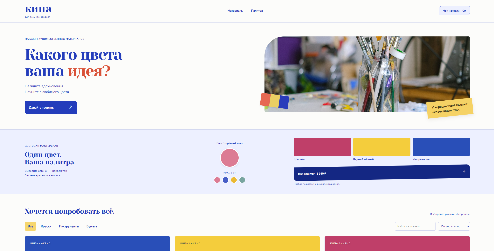
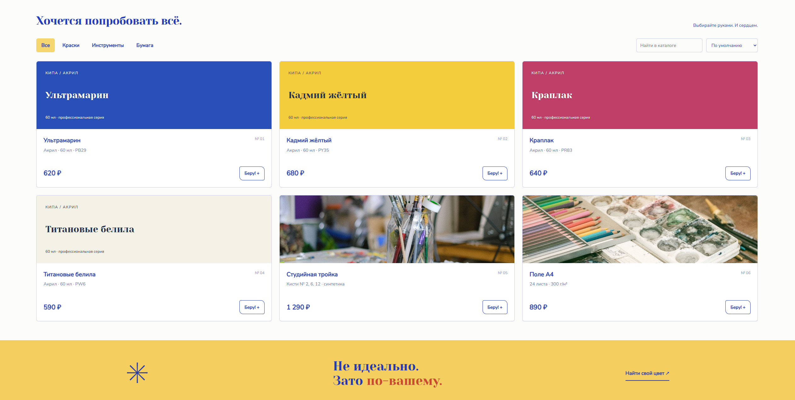

# КИПА

Интернет-магазин художественных материалов с каталогом, корзиной, оформлением тестовых заказов и интерактивным подбором красок по выбранному цвету.

Проект сделан как самостоятельный портфолио-кейс с клиентской частью, серверным API и локальной базой данных.

## О проекте

«КИПА» — концепт магазина для художников и тех, кто любит работать с цветом.

Главная идея проекта — сделать магазин не просто каталогом товаров, а добавить в него полезный интерактивный инструмент. В разделе «Цветовая мастерская» пользователь выбирает оттенок, после чего приложение находит три наиболее близкие краски из каталога.

Интерфейс построен вокруг яркой визуальной подачи, простого выбора материалов и понятного сценария покупки.

## Превью

### Десктоп





### Мобильная версия


## Возможности

- каталог художественных материалов;
- категории товаров;
- поиск по каталогу;
- сортировка по цене;
- подробные карточки товаров;
- корзина с изменением количества;
- сохранение корзины в `localStorage`;
- интерактивный выбор цвета;
- подбор трёх ближайших красок из каталога;
- добавление всей подобранной палитры в корзину;
- оформление тестового заказа;
- серверная проверка стоимости и остатков;
- учёт остатков товаров;
- бесплатная доставка от заданной суммы;
- адаптивный интерфейс;
- резервный статический режим работы без API.

## Технологии

### Frontend

- React 19
- TypeScript
- CSS

### Backend

- Node.js
- Node HTTP Server
- SQLite

### Сборка и инструменты

- esbuild
- TypeScript Compiler
- Docker
- Node Test Runner

## Цветовая мастерская

Пользователь выбирает исходный цвет через color picker или один из готовых оттенков.

Приложение сравнивает выбранный цвет с красками в каталоге и показывает три наиболее близких варианта.

Подбор используется как инструмент навигации по каталогу, а не как физический рецепт смешивания пигментов.

## API

Проект содержит собственный серверный API.

Основные маршруты:

```text
GET  /api/health
GET  /api/catalog
POST /api/orders
GET  /api/orders/:id
```

При оформлении заказа сервер повторно рассчитывает стоимость, проверяет остатки и сохраняет тестовый заказ в SQLite.

## Локальный запуск

Для проекта нужен Node.js 24 или новее.

Клонировать репозиторий:

```bash
git clone https://github.com/wakukiku/kipa.git
cd kipa
```

Установить зависимости:

```bash
npm install
```

Запустить проект:

```bash
npm run dev
```

По умолчанию приложение запускается по адресу:

```text
http://localhost:3000
```

## Production-сборка

Собрать проект:

```bash
npm run build
```

Запустить собранную версию:

```bash
npm start
```

## Проверка типов

```bash
npm run check
```

## Тесты

```bash
npm test
```

Тестами покрыты:

- логика подбора ближайших цветов;
- серверный расчёт стоимости заказа;
- проверка остатков;
- защита от повторной отправки заказа;
- изоляция заказов по пользовательским сессиям;
- сохранность данных SQLite.

## Переменные окружения

Пример конфигурации находится в `.env.example`.

```env
PORT=3000
HOST=127.0.0.1
DB_PATH=./data/store.sqlite
```

## Docker

В проекте есть `Dockerfile`.

Пример запуска:

```bash
docker build -t kipa .
docker run -p 3000:3000 kipa
```

## Статус

Проект завершён как портфолио-кейс.

Оформление заказа работает в демонстрационном режиме. Реальная оплата и доставка не выполняются.

---

**КИПА** — портфолио-проект интернет-магазина художественных материалов.
